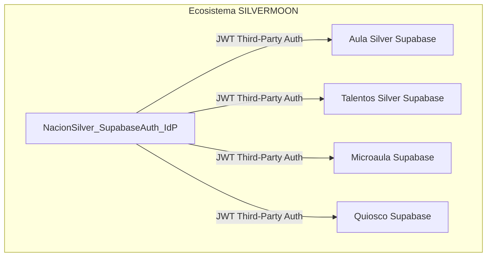
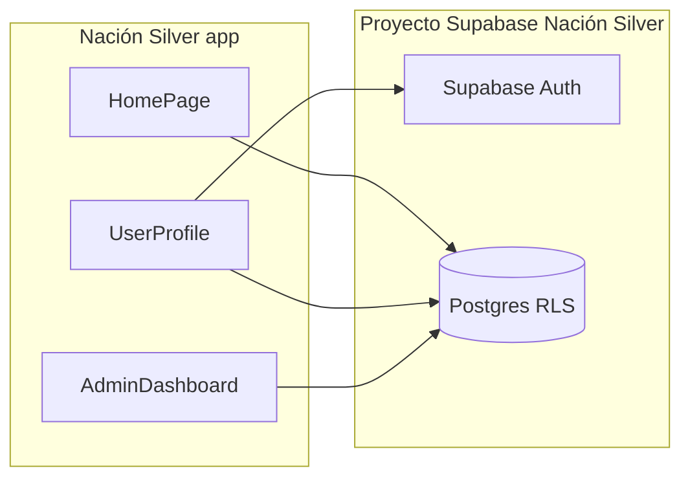

# Plan de proyecto Nación Silver

## Fuente de requisitos

Decisiones de producto e infraestructura provienen de **[nacion silver plan.docx](file:///c:/Users/jose_/OneDrive/Imágenes/SILVERMOON/NACION%20SILVER/nacion%20silver%20plan.docx)** (conversación exportada). La iteración vía enlace de Claude queda **obsoleta** frente a este documento.

**Sincronización con el repo:** ver [docs/REQUIREMENTS_SOURCES.md](docs/REQUIREMENTS_SOURCES.md) (orden de precedencia Word → roadmap → código; cómo actualizar ambos cuando cambie el plan).

**Documentación de apoyo en el repo:** [SUPABASE_REMOTE_REVIEW.md](docs/SUPABASE_REMOTE_REVIEW.md), [PHASE_A_SCOPE.md](docs/PHASE_A_SCOPE.md), [COMMUNITY_PRODUCT_SPEC.md](docs/COMMUNITY_PRODUCT_SPEC.md) (feed + grupos + Club Silver manual), [IDP_THIRD_PARTY_AUTH.md](docs/IDP_THIRD_PARTY_AUTH.md).

---

## Visión ecosistema SILVERMOON

- **Organización:** SILVERMOON Venezuela ([silvermoonve.org](https://silvermoonve.org)).
- **Comunidad Silver (identidad central):** quien se registra aquí obtiene un perfil reutilizable en **Aula Silver**, **Microaula**, **Bolsa / Talentos Silver**, **Quiosco**, etc.
- **Centralización de datos:** la identidad y el perfil canónico viven en el proyecto de **Nación Silver**; no se unifican bases de datos entre productos: cada app conserva su propio proyecto Supabase y su modelo de datos.

---

## Decisión de identidad (confirmada en el documento)

| Tema                    | Decisión                                                                                                                                                                                                                         |
| ----------------------- | -------------------------------------------------------------------------------------------------------------------------------------------------------------------------------------------------------------------------------- |
| **IdP**                 | **Supabase Auth** en el proyecto de Nación Silver (no Clerk ni Keycloak en el diseño final).                                                                                                                                     |
| **Motivo**              | Misma plataforma que el resto del stack, **hasta 50k MAU** en tier gratuito (documento lo contrasta con límites de Clerk), sin proveedor de identidad externo.                                                                   |
| **Evolución multi-app** | Cada otra app configura su Supabase con **Third-Party Auth** para confiar en los JWT emitidos por el proyecto de Nación Silver; `auth.uid()` y RLS siguen el mismo modelo mental, cambia solo el origen del token.               |
| **Proyecto “issuer”**   | El proyecto de Nación Silver es el que **no puede pausarse** cuando el negocio exija disponibilidad 24/7; entonces subir a **Pro** (~25/mes según el documento) solo ese proyecto es el costo “inevitable” cuando haya tracción. |

Nota: el documento original menciona **Next.js** para Nación Silver; el código actual es **Vite + React**. No es un conflicto de arquitectura de identidad; solo ajustar expectativas de despliegue y estructura de carpetas.

---

## Operación Supabase (multi-cuenta y pausing)

- Varios miembros del equipo pueden tener **hasta 2 proyectos free por organización**; el límite aplica de forma acumulada si eres Owner en varias orgs (el documento advierte del “workaround” de ser Owner en todo).
- **Pausado por inactividad:** en fase desarrollo/validación, **un check-in semanal** (incluso entrar al dashboard) evita que se pausen proyectos free.
- **Escalado monetizado:** el documento describe centralizar proyectos bajo una org Pro con coste incremental por proyecto adicional (orden de magnitud **~65/mes para 5 proyectos** en el escenario “todo en producción”); los números exactos deben validarse contra la [página de precios actual de Supabase](https://supabase.com/pricing).

---

## MAU (Supabase Auth)

- Cuentan usuarios con **eventos de autenticación en el ciclo de facturación** (login, refresco de token, logout). Quien no se autentica ese mes **no suma** a MAU.
- No hace falta “depurar” usuarios inactivos para reducir facturación: el volumen relevante es actividad mensual, no el total histórico de registros.

---

## Estado actual del código (línea base)

| Área              | Qué hay hoy                                                                                                                                                                                                                                                                                                              |
| ----------------- | ------------------------------------------------------------------------------------------------------------------------------------------------------------------------------------------------------------------------------------------------------------------------------------------------------------------------ |
| **Frontend**      | React 18, Vite 5, React Router, Tailwind; `[src/main.tsx](c:\Users\jose_\OneDrive\Imágenes\SILVERMOON\NACION SILVER\project\src\main.tsx)`, rutas en `[src/App.tsx](c:\Users\jose_\OneDrive\Imágenes\SILVERMOON\NACION SILVER\project\src\App.tsx)` (`/`, `/admin`, `/profile`, `/profile/:userId`).                     |
| **Supabase**      | Cliente en `[src/lib/supabase.ts](c:\Users\jose_\OneDrive\Imágenes\SILVERMOON\NACION SILVER\project\src\lib\supabase.ts)`. Variables `VITE_SUPABASE_URL` y `VITE_SUPABASE_ANON_KEY`.                                                                                                                                     |
| **Auth y perfil** | `[useAuth.ts](c:\Users\jose_\OneDrive\Imágenes\SILVERMOON\NACION SILVER\project\src\hooks\useAuth.ts)`, `[useProfile.ts](c:\Users\jose_\OneDrive\Imágenes\SILVERMOON\NACION SILVER\project\src\hooks\useProfile.ts)` — **ya sobre Supabase Auth** (alineado con la decisión de no usar Clerk).                           |
| **Admin**         | `[AdminDashboard.tsx](c:\Users\jose_\OneDrive\Imágenes\SILVERMOON\NACION SILVER\project\src\components\AdminDashboard.tsx)` + `[useAdmin.ts](c:\Users\jose_\OneDrive\Imágenes\SILVERMOON\NACION SILVER\project\src\hooks\useAdmin.ts)`.                                                                                  |
| **Marketing**     | `[SuccessStories.tsx](c:\Users\jose_\OneDrive\Imágenes\SILVERMOON\NACION SILVER\project\src\components\SuccessStories.tsx)`, `[CommunityShowcase.tsx](c:\Users\jose_\OneDrive\Imágenes\SILVERMOON\NACION SILVER\project\src\components\CommunityShowcase.tsx)`: datos estáticos; copy mezclado TechWise / Nación Silver. |
| **Base de datos** | Migraciones en `[supabase/migrations/](c:\Users\jose_\OneDrive\Imágenes\SILVERMOON\NACION SILVER\project\supabase\migrations)`.                                                                                                                                                                                          |

---

## Revisión de la base de datos Supabase (remota) y MCP

Objetivo: el estado **en producción / remoto** del proyecto Supabase vinculado a esta app debe coincidir con el contrato definido en `supabase/migrations/` (perfiles, contenidos, comunidad según migraciones vigentes, RLS, etc.).

### Orden recomendado

1. **Confirmar a qué proyecto apunta el entorno:** revisar `.env` / `.env.local` (no versionado) y que `VITE_SUPABASE_URL` y `VITE_SUPABASE_ANON_KEY` correspondan al proyecto correcto de Nación Silver.
2. **Revisión vía MCP (`user-supabase`):** cuando el servidor MCP de Supabase esté **conectado y sin error** en Cursor, usarlo como primera opción para inspeccionar el remoto (esquema, políticas, consistencia con lo esperado). Si el MCP no expone una operación concreta, usar las herramientas que sí estén disponibles (consultas SQL de inspección, listado de tablas, etc.) según el esquema del servidor.
3. **Si el MCP no está disponible:** en este workspace el servidor `user-supabase` puede aparecer en error (`[STATUS.md](C:\Users\jose_\.cursor\projects\c-Users-jose-OneDrive-Im-genes-SILVERMOON-NACION-SILVER-project\mcps\user-supabase\STATUS.md)`); conviene corregir **Cursor Settings → MCP** (token / URL del proyecto). Mientras tanto, revisión manual con:
  - [Supabase Dashboard](https://supabase.com/dashboard) → Table Editor / Authentication / Database → Policies;
  - [Supabase CLI](https://supabase.com/docs/guides/cli): `supabase link`, `supabase db diff` (contra remoto), `supabase db pull` si hace falta capturar drift.
4. **Si no existe proyecto remoto o conviene uno limpio:** la **creación de un proyecto nuevo** en Supabase suele hacerse en el **dashboard** (organización, región, contraseña de DB). Los MCPs raramente sustituyen ese paso completo; tras crear el proyecto, **enlazar** el repo con `supabase link` y aplicar migraciones con `supabase db push` (o el flujo de migraciones que uséis). Opcionalmente, si el MCP ofrece ejecutar SQL o migraciones, usarlo **después** de que el proyecto exista y esté enlazado.
5. **Criterio de éxito:** migraciones aplicadas sin errores; RLS coherente con los flujos de la app (`useAdmin`, `useAuth`, perfiles); triggers y contadores alineados; sin tablas duplicadas por migraciones conflictivas.

Este bloque alimenta el todo **db-review-mcp** y refuerza **ops-migrations**.

---

## Fases de trabajo

### Fase A — Producto Nación Silver (esta codebase)

- Conectar marketing a datos reales donde aplique (`success_stories`, `events`).
- Unificar branding **Nación Silver** (eliminar **TechWise** en UI).
- Alcance **rutas miembro** en [COMMUNITY_PRODUCT_SPEC.md](docs/COMMUNITY_PRODUCT_SPEC.md): feed guiado, grupos; **foros fuera de alcance.**
- Ajustar **RLS / visibilidad pública** si la landing debe mostrar contenido sin login.

### Fase B — Identidad federada (cuando conectes otras apps)

- Documentar en el equipo: URL del emisor, rotación de claves, mapeo de `sub` / user id entre proyectos.
- En cada app hija: configurar **Third-Party Auth** en el dashboard de Supabase según la documentación vigente (el documento de planificación asume compatibilidad; validar siempre contra docs oficiales al implementar).
- Pruebas end-to-end: login en Nación Silver → token aceptado en la app hija.

### Fase C — Operación

- Validar migraciones en el proyecto remoto; resolver solapamientos entre migraciones que crean las mismas tablas.
- Opcional: CI `lint` / `build`.

---

## Riesgos / deuda técnica

- **Migraciones:** validar orden al aplicar en un proyecto nuevo; alinear con `COMMUNITY_PRODUCT_SPEC.md` si se añaden tablas de feed/grupos.
- `**AdminDashboard.tsx`** muy grande: dividir por pestaña cuando se toque.
- **Third-Party Auth:** la oferta exacta (precio, límites, pasos de configuración) puede cambiar; conviene un checklist de verificación antes de cada integración nueva.

---

## Próximo paso

1. **db-review-mcp:** alinear remoto con migraciones (MCP si está disponible; si no, Dashboard + CLI).
2. Ejecutar **Fase A** en este repositorio; en paralelo **sso-idp-prep** cuando una segunda app del ecosistema esté lista para confiar en el JWT de Nación Silver.